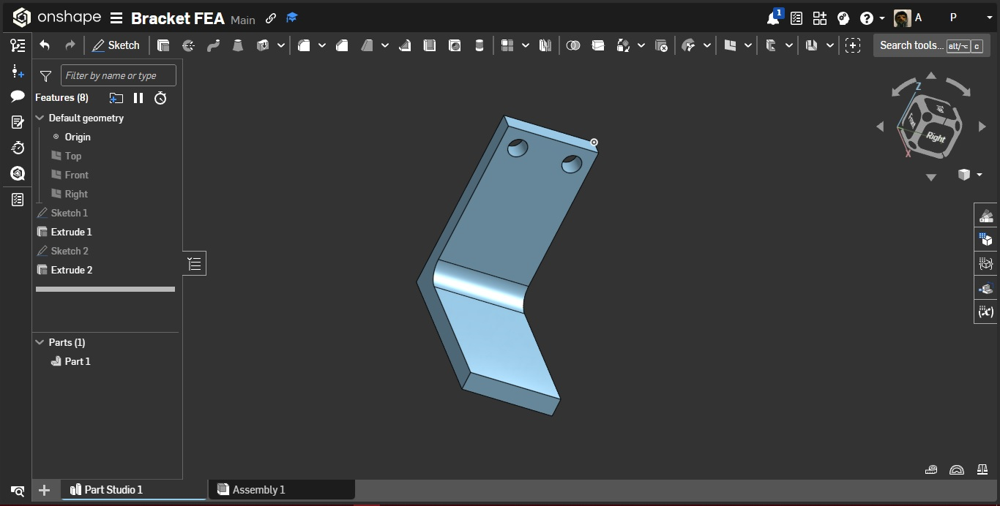
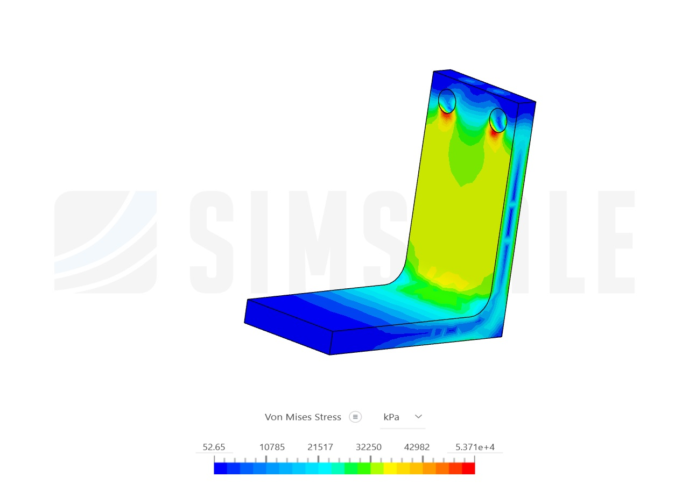
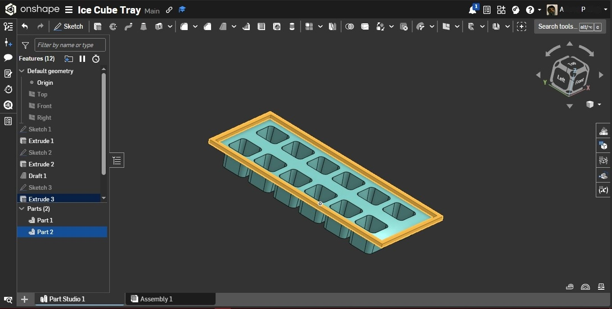

# cad-design-portfolio
# ⚙️ CAD Design & Physics Simulation Sandbox

Here's a  3D CAD and Finite Element Analysis (FEA)  hobby project to learn how things are built in the physical world. 

This repository is a sandbox for my side projects, exploring the intersection of geometry, physics, and Design for Manufacturing (DFM).

---

### 1. Structural Analysis: 500N Aluminum Mounting Bracket
**Tech Stack:** Onshape (Cloud CAD), SimScale (Cloud FEA), CalculiX Solver

An experiment in stress distribution and weight optimization. I designed a 10mm thick aluminum L-bracket and ran a cloud-based linear static simulation to validate its structural integrity under a 500N load. 

**The Workflow:**
1. **Geometry (Left):** Added a 10mm inner fillet to aggressively reduce stress concentrations at the 90-degree bend. 
2. **Analysis (Right):** Applied fixed-support constraints to the 10mm mounting holes and a 500N downward force to the flange. The von Mises stress map confirms the design safely distributes the load away from the bend.

  
  

---

### 2. Design for Manufacturing (DFM): Dual-Material Ice Cube Tray
**Tech Stack:** Onshape (Cloud CAD)

A study in designing consumer products for injection molding. 

**Engineering Constraints Applied:**
* **Multi-Body Architecture:** Modeled a flexible silicone base combined with a rigid plastic outer rim.
* **Draft Angles:** Applied a strict 3-degree draft angle to all inner vertical walls of the 2x6 cavity grid to prevent vacuum-locking during mold ejection.
* **Uniform Wall Thickness:** Utilized the Shell tool on the bottom of the tray to hollow out excess material, preventing thermal warping and cosmetic sink marks during plastic cooling.

  

